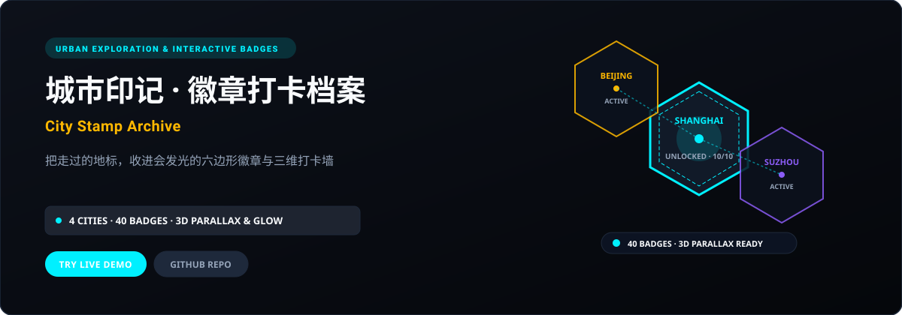
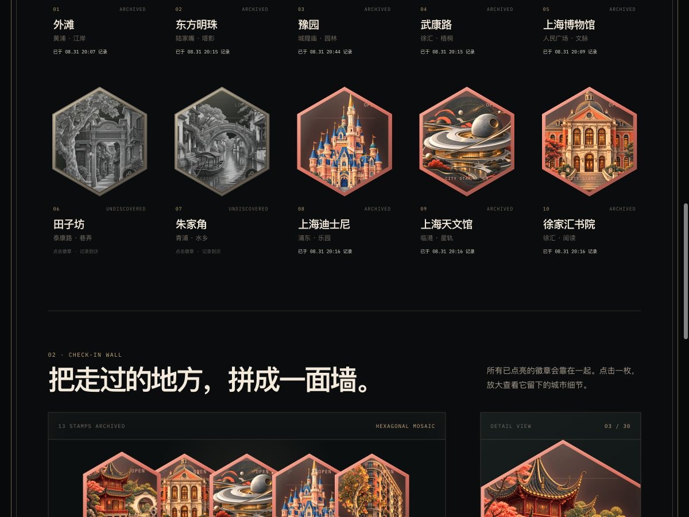

<p align="right">
  <strong>简体中文</strong> · <a href="./README.en.md">English</a>
</p>

<p align="center">
  
</p>

<p align="center">
  <a href="https://city-stamp.xiaosang.cc/"><strong>🌐 在线体验 (Live Demo)</strong></a> · 
  <a href="https://holynova.github.io/city-stamp/"><strong>🚀 备选镜像 (GitHub Pages)</strong></a> · 
  <a href="https://github.com/holynova/city-stamp"><strong>📦 GitHub 源码</strong></a> · 
  <a href="https://xiaosang.cc/"><strong>✨ 更多作品集</strong></a>
</p>

---

## 真实预览 (Proof of Work)

<p align="center">
  
</p>

---

## 项目简介 (What It Is)

专为城市漫步者打造的沉浸式打卡档案馆。收录上海、苏州、北京、杭州各 10 个代表性地标，共 40 枚精致六边形金属徽章。未点亮时呈现深邃灰阶与金属哑光，点击点亮后即时激活霓虹辉光并记录打卡时间戳。

---

## 核心机制与特色 (Why It Matters)

- **六边形发光状态机**：灰阶未解锁状态 vs 荧光点亮态微流动效，支持打卡时间戳精确记录与持久化。
- **全视角 3D 悬浮视差**：基于陀螺仪与鼠标坐标的实时三维多层视差响应，呈现徽章金属质感厚度。
- **蜂窝式可缩放徽章墙**：流畅缩放平移的蜂窝打卡墙，一览四座名城探索全貌与解锁进度。
- **个性化足迹分享卡片**：动态生成包含已解锁徽章阵列、城市完成率与探索者签名的精美分享卡片。

---

## 收录清单与规格 (Inventory & Scope)

【上海】东方明珠、武康大楼、外滩海关大楼、陆家嘴三件套等；【苏州】金鸡湖东方之门、拙政园、虎丘塔、平江路等；【北京】故宫角楼、天坛祈年殿、鸟巢、国家大剧院等；【杭州】雷峰塔、三潭印月、拱宸桥等。

---

## 快速开始 (Quick Start)

### 1. 在线体验
无需安装任何环境，直接在浏览器中打开：
- 🌐 **主站演示 (Primary)**：[https://city-stamp.xiaosang.cc/](https://city-stamp.xiaosang.cc/)
- 🚀 **备选镜像 (GitHub Pages)**：[https://holynova.github.io/city-stamp/](https://holynova.github.io/city-stamp/)

### 2. 本地运行与调试
克隆仓库后执行以下命令：

```bash
git clone https://github.com/holynova/city-stamp.git
cd city-stamp
open index.html # Pure static HTML5, zero build required
```

---

## 开源协议与作者 (License & Author)

- **作者**：[holynova (小桑)](https://xiaosang.cc/)
- **授权协议**：[MIT License](./LICENSE)
- **合辑收录**：本仓库作为精选项目收录于 [Where Craft Lives (xiaosang.cc)](https://xiaosang.cc/)。
