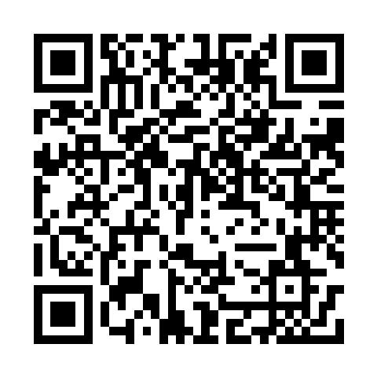

# 城市印记 · City Stamp

把走过的地标，收进会发光的六边形徽章。

上海、苏州、北京各 10 个地标，共 30 枚。默认灰阶，点击后点亮、变色、发光，并记录访问时间到浏览器本地。支持切换城市、筛选与足迹；Umami 统计流量。

[GitHub Repo](https://github.com/holynova/city-stamp) · [GitHub Pages](https://holynova.github.io/city-stamp/)

扫码打开：

